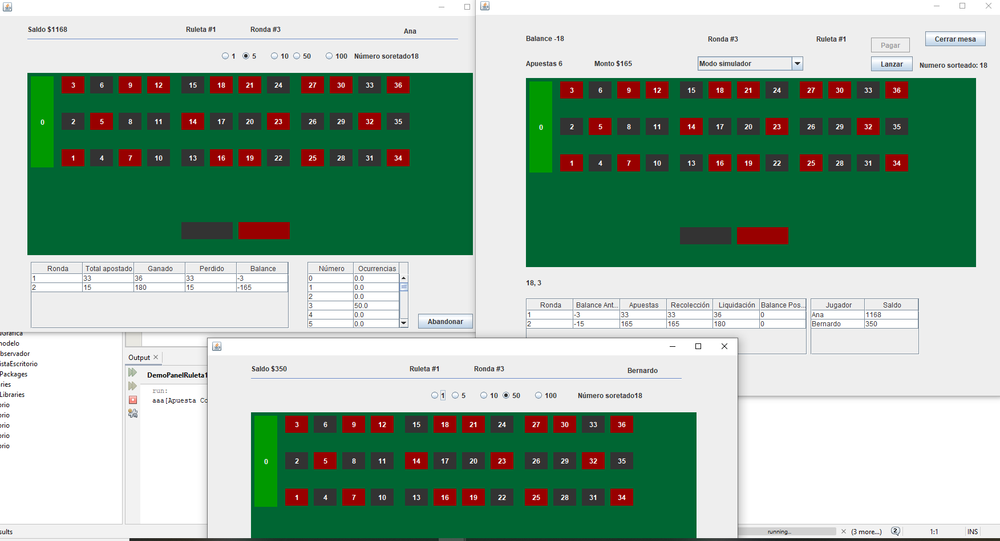

# 🎰 Demo Panel Ruleta

Este proyecto es una **demo visual** desarrollada en Java para representar el panel de una ruleta como parte de un trabajo académico en la materia Diseño y Desarrollo de Aplicaciones (ORT Uruguay, 2023).

---

## 🛠️ Tecnologías

- **Lenguaje:** Java
- **IDE sugerido:** NetBeans
- **Interfaz gráfica:** Swing

---

## ▶️ Cómo ejecutar

1. Abrir el proyecto `DemoPanelRuleta_1` en NetBeans.
2. Ejecutar la clase principal desde `src/demopanelruleta/DemoPanelRuleta.java`.

---

## 📸 Captura

---

## 📚 Créditos

Trabajo realizado por:

- **Agustina Goñi**
- **Analia Bernat**

Universidad ORT Uruguay — 2023
