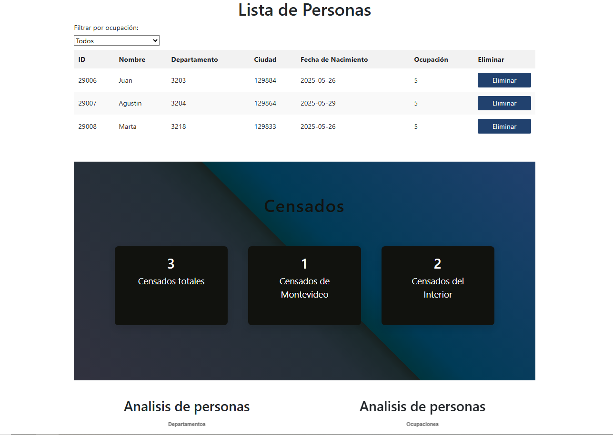

# 📊 Censo 2023 - Frontend App

Este proyecto fue desarrollado como parte del curso **Taller de Desarrollo Frontend** (ORT Uruguay, 2023). Se trata de una aplicación web que permite registrar datos de personas censadas por un usuario (censista), accediendo a una API REST externa para el almacenamiento y consulta de la información.

---

## 🚀 Funcionalidades principales

- Registro y login de censistas con manejo de tokens y persistencia en `localStorage`.
- Registro de personas censadas (nombre, departamento, ciudad, fecha de nacimiento, ocupación).
- Eliminación de registros individuales.
- Filtro por tipo de ocupación.
- Cálculo automático del total de censados y distribución por ubicación.
- Visualización de gráficos estadísticos:
  - Personas por departamento
  - Personas por ocupación
  - Porcentaje censado del total
  - Mapa de distribución por departamento
  - Tiempo restante hasta el fin del censo (31 de agosto de 2023)

---

## 🧰 Tecnologías utilizadas

- **React** para la interfaz
- **Redux** para el manejo de estado
- **React Router** para la navegación
- **Chart.js** o similar para gráficas
- **Fetch API** para llamadas a la API REST

---

## ▶️ Instrucciones para correr el proyecto

1. Clonar este repositorio.
2. Ejecutar `npm install` para instalar las dependencias.
3. Configurar la URL base de la API REST si corresponde.
4. Ejecutar `npm start` para iniciar la aplicación en modo desarrollo.

---

## 📸 Capturas de pantalla

---

## 👥 Autoras

- Agustina Goñi

Proyecto académico — Universidad ORT Uruguay