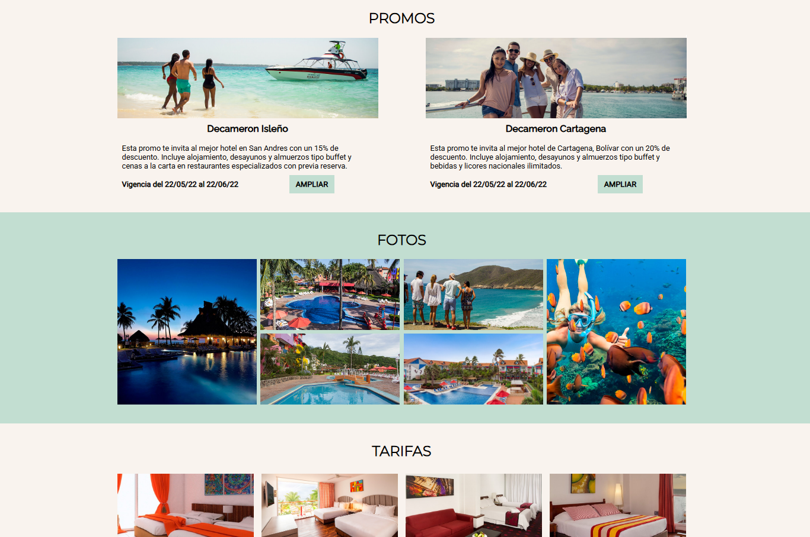

# Proyectos_facultad

Este proyecto es un trabajo obligatorio del año 2022 para la asignatura **Diseño de Interfaz Web**, correspondiente a la carrera **Analista en Tecnologías de la Información** de la **Universidad ORT Uruguay**.

Fue realizado de forma individual por Agustina.

## Tecnologías utilizadas

- HTML5  
- CSS3

## Cómo visualizarlo

Abrí el archivo `index.html` en tu navegador web.

## Captura de pantalla

